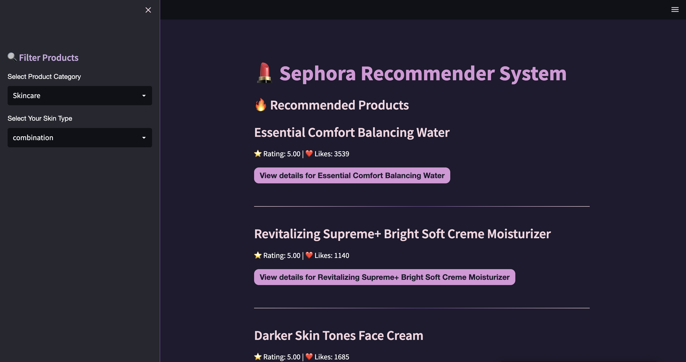
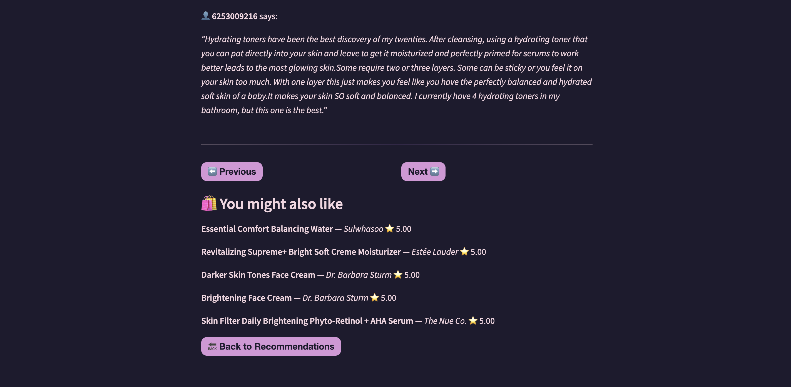
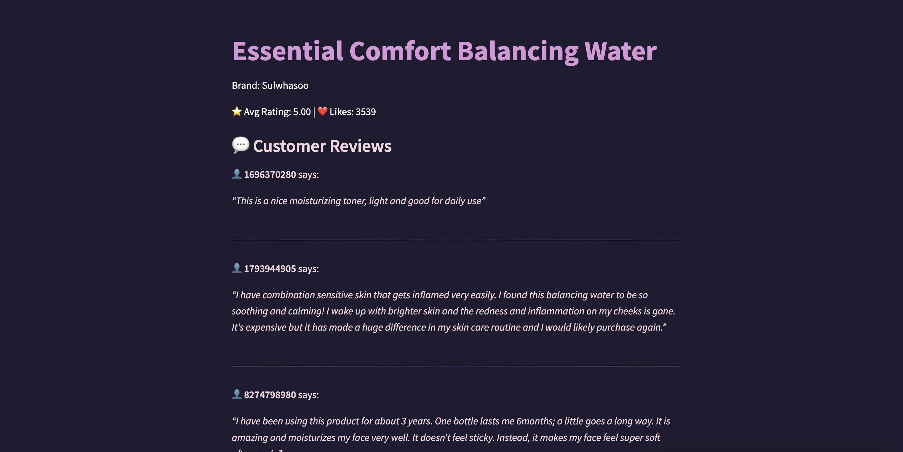

# 💄 Sephora Recommender System

A personalized beauty product recommender system powered by product metadata and user reviews from Sephora. Built with a focus on both user experience and data-driven insights.

---

## 📊 Exploratory Data Analysis (EDA)

The first phase of the project dives into the Sephora dataset to uncover user behaviors and product patterns. Highlights include:

- Distribution of ratings and recommendation trends
- Group analysis by skin type, tone, and hair color
- Correlation between loves count, price, and helpfulness
- Cleaned & preprocessed datasets for products and reviews
- Visualizations with `matplotlib` and `seaborn`

_Notebooks available in:_ `sephora_eda.ipynb`

---

## 🧠 Recommender System

The recommendation engine leverages multiple approaches:

- **Content-Based Filtering**: by category, skin type compatibility, etc.
- **Collaborative Filtering**: based on user review patterns
- **Hybrid Approach**: combines both for improved personalization

The full UI is built using **Streamlit**, with a clean and aesthetic design tailored for beauty-focused users.

---

## 🧪 Model Evaluation & Fine-Tuning

Planned:
- Evaluate with precision, recall, etc.
- Compare models using A/B testing
- Optimize similarity measures and filtering thresholds

---

## 🛠 Tech Stack

- **Python** (pandas, matplotlib, seaborn, scikit-learn)
- **Jupyter Notebook**
- **Streamlit** for frontend UI

---

## 📦 Installation & Run

1. Clone the repository:
   ```bash
   git clone https://github.com/jiatangzhi/sephora_recommender_system.git
   cd sephora_recommender_system
   ```

2. Create and activate a virtual environment:
    ```bash
    python -m venv .venv
    source .venv/bin/activate
    ```

3. Install dependencies:
    ```bash
    pip install -r requirements.txt
    ```

4. Run the Streamlit app:
    ```bash
    streamlit run app/main.py
    ```

## 🖼 UI Demo

A glimpse into the user interface built with Streamlit:

| Screenshot | Description |
|------------|-------------|
|  | **Landing page** with product filters for skin type and category. |
|  | **Personalized recommendations** with product ratings and likes. |
|  | **Detailed view** showing customer reviews and related products. |


---

*Mini project by Jia Tang Zhi 💕*
